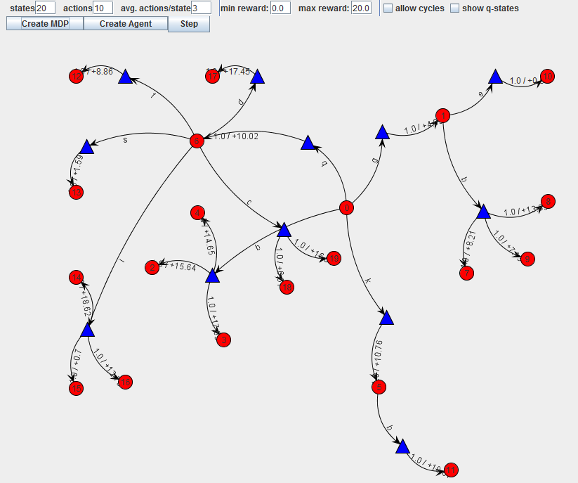
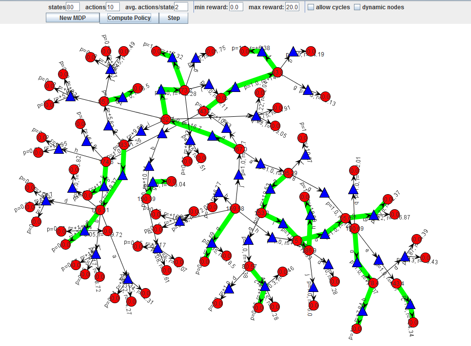
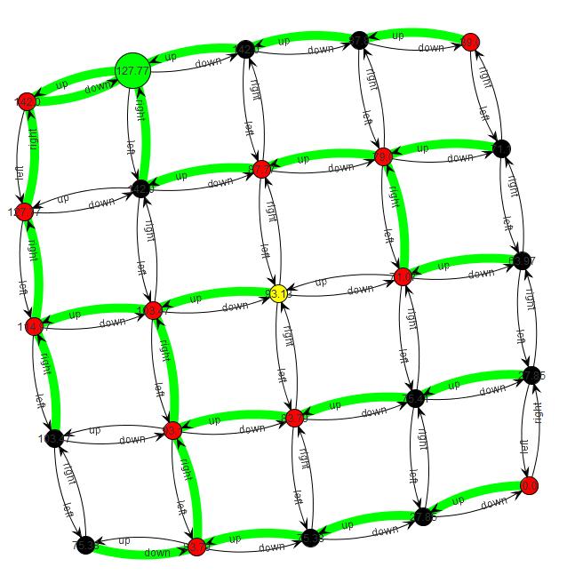
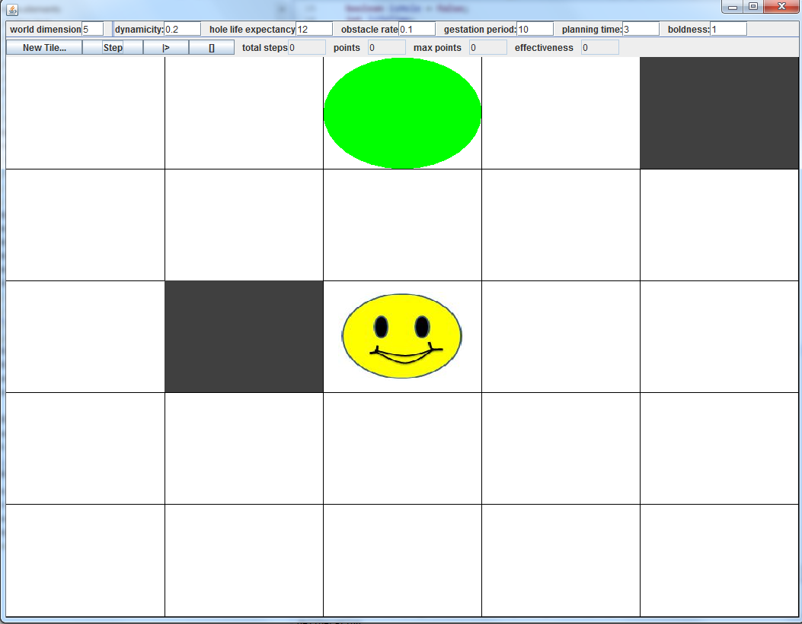
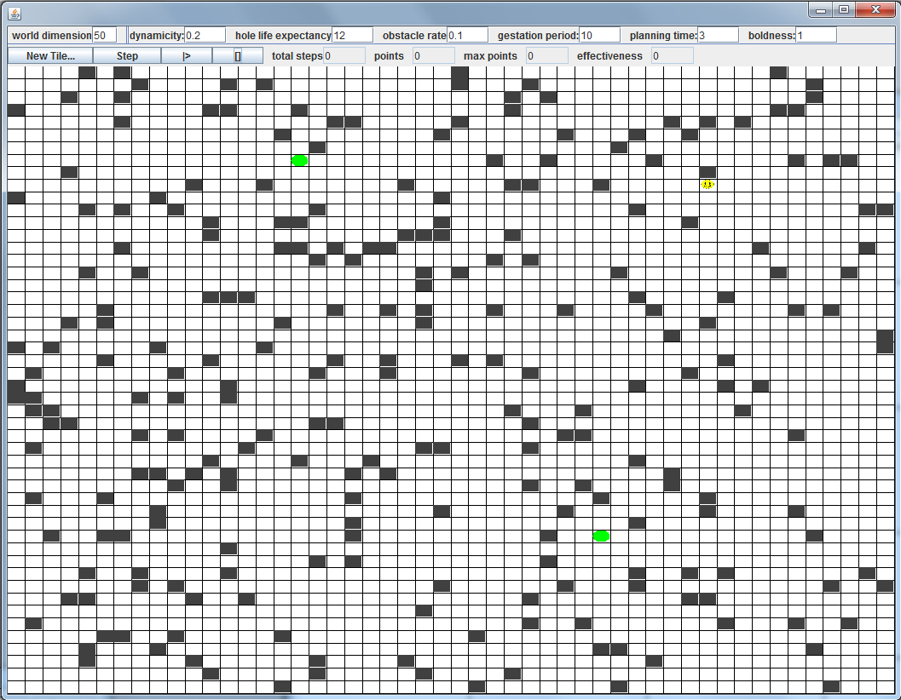

# mdp-plan-revision

Read a more detailed description of the conceptual underpinnings and experimental results in the following paper:

> [Intention Reconsideration as Metareasoning](http://www.marcvanzee.nl/publications/2015/borm2015_metareasoning.pdf) ([Marc van Zee](http://www.marcvanzee.nl), [Thomas Icard](http://stanford.edu/~icard/)), [In Bounded Optimality and Rational Metareasoning NIPS 2015 Workshop](https://sites.google.com/site/boundedoptimalityworkshop/home), 2015. 

### Summary

This project implements an agent that is situated on a [Markov Decision Process (MDP)](https://en.wikipedia.org/wiki/Markov_decision_process). 

The agent is able to compute the optimal policy through [Value Iteration](http://artint.info/html/ArtInt_227.html). 

The MDP is changing over time, and the agent can respond to this change by either acting (i.e. executing the optimal action according to its current policy) or thinking (i.e. computing a new policy). The task is to learn the best meta-reasoning strategy, i.e. deciding when to think or act, based on the characteristics of the envrionment.

This general setup is quite complex, so we have simplified the environment (i.e. the MDP) to the TIleworld environment. This consists of an agent that is situated on a grid. It can move up, down, left, or right and has to fill holes, which means it has to reach specific states in the grid. It cannot move through obstacles.

In the above screenshot, the agent is represented by a yellow state, obstacles are represented by black states, goal states by larger green states, and "normal" grid states by red states. In order to simplify the Tileworld visualization, we have developed an alternative one:

Note that this is still an MDP: We have only simplified the visualization. This allows us to visualize larger Tileworld scenarios easily:

We then develop several metareasoning strategies that the agent can use. Read a more detailed description of the conceptual underpinnings and experimental results in our paper:

> [Intention Reconsideration as Metareasoning](http://www.marcvanzee.nl/publications/2015/borm2015_metareasoning.pdf) ([Marc van Zee](http://www.marcvanzee.nl), [Thomas Icard](http://stanford.edu/~icard/)), [In Bounded Optimality and Rational Metareasoning NIPS 2015 Workshop](https://sites.google.com/site/boundedoptimalityworkshop/home), 2015. 
